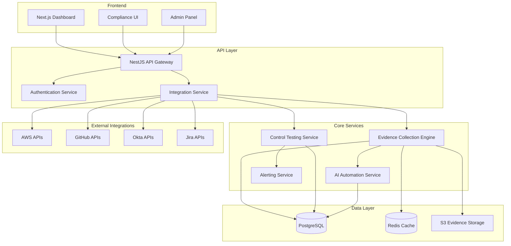

# Compliance Automation Platform - Complete Roadmap

**Project Name:** Kushim (Compliance Automation Platform)  
**Market Opportunity:** $42.19B by 2031  
**Target:** B2B SaaS companies needing SOC 2, ISO 27001, HIPAA compliance  
**Validation Status:** ✅ Double-validated (Industry research + Real customer reviews)  
**Last Updated:** February 1, 2026

---

## 📊 Market Validation Summary

### Industry Research (NotebookLM - 122 Sources)

- **Market Size:** $42.19B by 2031, $16.6B in 2025
- **Customer Spending:** $12K-$500K/year per company
- **Pain Points:**
  - 234 regulatory alerts/day (25x increase over decade)
  - 41% of businesses report sales delays due to compliance gaps
  - Average breach cost: $4.88M
  - 40% of compliance teams still use spreadsheets
  - Manual compliance physically impossible at current scale

### Real Customer Analysis (40-50 Reviews)

- **60% complain:** Brittle integrations that constantly break
- **55% complain:** Massive manual work despite "automation" claims
- **40% complain:** No work management integration (Jira/Linear/GitHub)
- **30% complain:** No real-time monitoring (only point-in-time snapshots)
- **45% complain:** Opaque pricing with hidden add-ons

### Competitive Landscape

**Current Players:** Vanta, Drata, Secureframe, OneTrust, ServiceNow
**Their Weaknesses:**

- 50% integration failure rates
- Rigid templates that don't fit complex businesses
- No continuous monitoring (only annual audit prep)
- Forced vendor lock-in with auditors
- Aggressive price hikes after first year

---

## 🎯 Product Vision

### Value Proposition

**"Continuous Compliance That Actually Works"**

Stop fighting brittle integrations and manual evidence collection. Get bulletproof automation with real-time monitoring and native developer workflow integration.

### Core Differentiators

1. **99.9% Integration Uptime** - Bulletproof connections with auto-retry logic
2. **Real-Time Monitoring** - Always audit-ready, not point-in-time snapshots
3. **Developer-First** - Native Jira/Linear/GitHub integration
4. **True AI Automation** - Evidence mapping, policy drafting, control analysis
5. **Transparent Pricing** - All-in pricing, no hidden add-ons, auditor-agnostic

---

## 🚀 Product Roadmap

### Phase 1: MVP - Core Differentiators (Months 1-3)

**Goal:** Prove integration reliability + real-time monitoring

#### Technical Features

**1. Bulletproof Integration Engine**

```typescript
// Core architecture principles
- Exponential backoff retry logic (5 attempts)
- Real-time connection health monitoring
- Detailed error logging (not just "connection failed")
- Circuit breaker pattern for failing services
- Webhook support for instant updates
```

**2. Core Integrations (5 Only)**

- **AWS** (S3, IAM, CloudTrail, Config, GuardDuty)
- **GitHub** (PR reviews, branch protection, commit signing, repo access)
- **Okta/Azure AD** (MFA, provisioning, access reviews, session policies)
- **Jira/Linear** (task sync, remediation tracking, status updates)
- **Slack** (alerts, notifications, compliance bot)

**3. Real-Time Compliance Dashboard**

- Live compliance score (updates every 15 minutes)
- Control status by framework
- Evidence collection status
- Drift detection alerts
- Audit readiness indicator

**4. Jira Integration (Secret Weapon)**

- Auto-create tickets for failing controls
- Sync remediation status back to compliance platform
- Developers never leave Jira
- Track compliance work in existing sprint workflow

**5. SOC 2 Type II Framework**

- Focus on Trust Services Criteria (CC, A, PI, C, P)
- 64 control points mapped
- Automated evidence collection for 80% of controls
- Manual upload for remaining 20%

#### Success Metrics

- [ ] 5 paying customers at $35K/year = **$175K ARR**
- [ ] 99.9% integration uptime (measured)
- [ ] 80% reduction in manual work (customer survey)
- [ ] NPS > 50
- [ ] <10% churn rate

---

### Phase 2: AI Automation (Months 4-6)

**Goal:** Deliver on "true automation" promise competitors failed on

#### AI-Powered Features

**1. Evidence Mapping Agent**

```typescript
// Use GPT-4/Claude to automatically map evidence to controls
- Analyze collected evidence (logs, configs, screenshots)
- Map to relevant SOC 2 controls
- Suggest additional evidence needed
- Learn from auditor feedback
- Reduce manual mapping from 10 hours → 30 minutes
```

**2. Policy Drafting Assistant**

- Generate policy text from control requirements
- Customize for company context (industry, size, tech stack)
- Version control and change tracking
- Compliance with multiple frameworks simultaneously
- Natural language policy queries

**3. Natural Language Queries**

- "Show me all failing MFA controls"
- "What evidence is missing for SOC 2 CC6.1?"
- "Generate compliance report for Q4 board meeting"
- "Which controls are at risk for next audit?"

**4. Automated Control Testing**

- Schedule compliance checks (daily/weekly)
- Auto-verify evidence validity
- Flag anomalies for human review
- Predictive risk scoring
- Continuous control monitoring

**5. Compliance Copilot**

- Chat interface for compliance questions
- Context-aware suggestions
- Audit preparation assistant
- Remediation guidance

#### Additional Integrations

- Google Workspace (Drive, Admin, Groups)
- Microsoft 365 (Azure AD, Intune, Defender)
- Datadog/New Relic (monitoring evidence)
- PagerDuty (incident response)
- 1Password/LastPass (secrets management)

#### Success Metrics

- [ ] 15 paying customers = **$525K ARR**
- [ ] 90% evidence auto-mapped by AI
- [ ] 70% policy drafts accepted without edits
- [ ] <5% churn rate
- [ ] 3+ customer case studies

---

### Phase 3: Scale & Enterprise (Months 7-12)

**Goal:** Expand to multi-framework and enterprise features

#### Additional Frameworks

- **ISO 27001** (114 controls)
- **HIPAA** (Security Rule, Privacy Rule)
- **GDPR** (Data protection requirements)
- **PCI-DSS** (Payment card industry)
- **NIST CSF** (Cybersecurity framework)

#### Enterprise Features

**1. Multi-Tenant Architecture**

- Separate workspaces per business unit
- Consolidated reporting across units
- Granular RBAC per workspace

**2. Custom Control Frameworks**

- Build custom frameworks for unique requirements
- Map custom controls to standard frameworks
- Industry-specific templates (FinTech, HealthTech)

**3. Advanced RBAC**

- Role-based access control
- Audit trail for all actions
- Approval workflows for policy changes
- Segregation of duties enforcement

**4. Enterprise Integrations**

- ServiceNow (GRC integration)
- Salesforce (compliance in sales process)
- Workday (HR data sync)
- Custom API integrations

**5. White-Label Options**

- Custom branding for MSPs
- Multi-customer management
- Reseller program

**6. Advanced Reporting**

- Executive dashboards
- Board-ready compliance reports
- Trend analysis and forecasting
- Custom report builder

#### Success Metrics

- [ ] 40 paying customers = **$2M ARR**
- [ ] 2+ enterprise deals ($300K+)
- [ ] Profitability or clear path to it
- [ ] Series A fundraising ready
- [ ] <3% churn rate

---

## 💰 Pricing Strategy

### Positioning: Premium Quality, Transparent Pricing

**Key Principle:** Customers will pay 30-50% more for reliability. Don't compete on price.

### Pricing Tiers

**Starter: $35,000/year**

- **Target:** Series A companies (20-100 employees)
- **Frameworks:** SOC 2 Type II
- **Integrations:** 10 core integrations
- **Features:**
  - Real-time compliance dashboard
  - Jira/Linear sync
  - Automated evidence collection
  - Email support (24-hour response)
  - Quarterly compliance reviews
- **Value Prop:** "Pay 30% more than competitors, eliminate 80% of manual work"

**Growth: $100,000/year**

- **Target:** Series B companies (100-500 employees)
- **Frameworks:** SOC 2 + ISO 27001 + HIPAA
- **Integrations:** 25+ integrations
- **Features:**
  - Everything in Starter
  - AI automation (evidence mapping, policy drafting)
  - Continuous monitoring with instant alerts
  - Priority support (4-hour response)
  - Monthly compliance reviews
  - Custom control frameworks
- **Value Prop:** "Always audit-ready, no 2-3 week prep sprints"

**Enterprise: $300,000+/year**

- **Target:** Series C+ companies (500+ employees)
- **Frameworks:** Unlimited
- **Integrations:** Unlimited + custom integrations
- **Features:**
  - Everything in Growth
  - Dedicated Customer Success Manager
  - White-label options
  - Multi-tenant architecture
  - SLA guarantees (99.9% uptime)
  - Custom reporting and dashboards
  - Audit support (auditor coordination)
- **Value Prop:** "Replace 2-3 FTE compliance engineers"

### Pricing Principles

✅ **All-in pricing** (no add-ons for basic features)  
✅ **30-day money-back guarantee** (builds trust)  
✅ **Auditor-agnostic** (use any auditor you want)  
✅ **Annual contracts preferred** (monthly available at +20%)  
✅ **Transparent pricing page** (no "contact sales" gatekeeping)

### Revenue Projections

- **Month 3:** 5 customers × $35K = **$175K ARR**
- **Month 6:** 15 customers (avg $35K) = **$525K ARR**
- **Month 12:** 40 customers (avg $50K) = **$2M ARR**
- **Month 18:** 80 customers (avg $60K) = **$4.8M ARR** (Series A ready)

---

## 🎯 Go-to-Market Strategy

### Ideal Customer Profile (ICP)

**Primary Target:** Series A-B SaaS companies preparing for first SOC 2 audit

**Characteristics:**

- 20-200 employees
- $2M-$20M ARR
- Selling to enterprise customers (Fortune 500, government)
- Losing deals due to lack of compliance certification
- Technical founder/CTO involved in buying decisions
- Engineering-led culture
- Using modern tech stack (AWS, GitHub, Jira)

**Secondary Target:** FinTech/HealthTech startups (regulated industries)

**Where to Find Them:**

- Y Combinator portfolio (W24, S24, W25 batches)
- TechCrunch funding announcements (Series A)
- LinkedIn (search: "Series A" + "SOC 2" + "hiring")
- Compliance-focused Slack communities (r/soc2, r/cybersecurity)
- Audit firm referrals

### Marketing Channels

**1. Content Marketing (SEO + Thought Leadership)**

_Blog Topics:_

- "Why Vanta/Drata Integrations Break (And How We Fixed It)"
- "Real-Time Compliance: The Future of SOC 2"
- "Compliance Tasks in Jira: A Developer's Guide"
- "SOC 2 Cost Breakdown: What You'll Actually Pay"
- "Integration Reliability: Our 99.9% Uptime Architecture"

_Technical Deep-Dives:_

- Open-source compliance check examples
- AWS compliance automation scripts
- GitHub Actions for continuous compliance

**2. Partner with Audit Firms**

- Referral agreements with mid-tier firms (not Big 4)
- Co-marketing webinars: "Preparing for Your First SOC 2 Audit"
- "Preferred technology partner" status
- Revenue share: 10-15% of first-year contract

**3. Community Building**

- Active presence on r/cybersecurity, r/soc2, r/SaaS
- Compliance automation Slack/Discord community
- Weekly "Office Hours" for compliance questions
- Open-source compliance tools (lead generation)

**4. Direct Outreach**

- Target companies 6-12 months pre-audit
- Personalized demos showing integration reliability
- Free compliance readiness assessment (lead magnet)
- LinkedIn outreach to CTOs/VPs of Engineering

**5. Product-Led Growth**

- Free compliance health check tool
- Public compliance dashboard (show your own compliance)
- Integration testing tool (test your AWS/GitHub setup)
- Compliance cost calculator

### Sales Process

**Stage 1: Discovery Call (30 min)**

- Understand current compliance state
- Identify pain points with current tools
- Assess technical stack (integrations needed)
- Qualify budget and timeline

**Stage 2: Technical Demo (45 min)**

- Live demo of integration reliability
- Show real-time monitoring dashboard
- Demonstrate Jira integration
- Walk through evidence collection

**Stage 3: Proof of Concept (2 weeks)**

- Connect to 2-3 integrations
- Run compliance checks
- Generate sample evidence
- Show ROI calculation

**Stage 4: Proposal & Close (1 week)**

- Custom pricing based on company size
- SOW with clear deliverables
- 30-day money-back guarantee
- Annual contract with quarterly reviews

**Average Sales Cycle:** 4-6 weeks (Series A), 8-12 weeks (Enterprise)

---

## 🛠️ Technical Architecture

### Tech Stack

**Backend:**

- **Runtime:** Node.js 20+ / TypeScript 5+
- **Framework:** NestJS (modular, enterprise-ready)
- **Database:** PostgreSQL 16 (audit trails, compliance data)
- **Cache:** Redis 7 (job queues, session management)
- **Queue:** BullMQ (background jobs for evidence collection)
- **ORM:** Prisma (type-safe database access)

**Frontend:**

- **Framework:** Next.js 14 (React 18, App Router)
- **Styling:** TailwindCSS 3 + shadcn/ui
- **State:** Zustand (lightweight state management)
- **Charts:** Recharts (compliance dashboards)
- **Forms:** React Hook Form + Zod validation

**Infrastructure:**

- **Cloud:** AWS (ECS Fargate, RDS, S3, CloudWatch)
- **CDN:** CloudFront (global distribution)
- **Monitoring:** Datadog (APM, logs, metrics)
- **Error Tracking:** Sentry
- **CI/CD:** GitHub Actions
- **IaC:** Terraform (infrastructure as code)

**AI/Automation:**

- **LLMs:** OpenAI GPT-4 Turbo, Anthropic Claude 3.5 Sonnet
- **Orchestration:** LangChain / LangGraph (agent workflows)
- **Vector DB:** Pinecone (policy/control embeddings)
- **Embeddings:** OpenAI text-embedding-3-large

**Integrations:**

- **AWS:** AWS SDK for JavaScript v3
- **GitHub:** Octokit (REST + GraphQL APIs)
- **Okta:** Okta SDK for Node.js
- **Jira:** Jira Cloud REST API
- **Slack:** Bolt for JavaScript

### System Architecture



### Key Architecture Decisions

**1. Integration Reliability Pattern**

```typescript
// Bulletproof retry logic with exponential backoff
async function retryWithBackoff<T>(
  fn: () => Promise<T>,
  maxRetries: number = 5,
  baseDelay: number = 1000,
): Promise<T> {
  for (let attempt = 0; attempt < maxRetries; attempt++) {
    try {
      return await fn();
    } catch (error) {
      if (attempt === maxRetries - 1) {
        // Log to monitoring system
        await logIntegrationFailure(error);
        throw error;
      }

      const delay = baseDelay * Math.pow(2, attempt);
      await sleep(delay);
    }
  }
}

// Circuit breaker pattern
class CircuitBreaker {
  private failureCount = 0;
  private lastFailureTime?: Date;
  private state: "CLOSED" | "OPEN" | "HALF_OPEN" = "CLOSED";

  async execute<T>(fn: () => Promise<T>): Promise<T> {
    if (this.state === "OPEN") {
      if (this.shouldAttemptReset()) {
        this.state = "HALF_OPEN";
      } else {
        throw new Error("Circuit breaker is OPEN");
      }
    }

    try {
      const result = await fn();
      this.onSuccess();
      return result;
    } catch (error) {
      this.onFailure();
      throw error;
    }
  }
}
```

**2. Real-Time Monitoring**

```typescript
// Continuous control checks (every 15 minutes)
import { CronJob } from "cron";

const complianceCheckJob = new CronJob("*/15 * * * *", async () => {
  const customers = await getActiveCustomers();

  for (const customer of customers) {
    const results = await runComplianceChecks(customer.id);
    const drift = await detectDrift(customer.id, results);

    if (drift.length > 0) {
      await alertOnFailures(customer.id, drift);
      await createJiraTickets(customer.id, drift);
    }

    await updateComplianceScore(customer.id, results);
  }
});

complianceCheckJob.start();
```

**3. Evidence Immutability**

```typescript
// Tamper-proof audit trails
import crypto from "crypto";

interface Evidence {
  id: string;
  customerId: string;
  controlId: string;
  data: any;
  collectedAt: Date;
  hash: string;
  previousHash?: string;
}

function createEvidence(data: any, previousHash?: string): Evidence {
  const evidence = {
    id: generateId(),
    customerId: getCurrentCustomer(),
    controlId: data.controlId,
    data,
    collectedAt: new Date(),
    hash: "",
    previousHash,
  };

  // Create blockchain-style hash chain
  const hashInput = JSON.stringify({
    ...evidence,
    previousHash,
  });

  evidence.hash = crypto.createHash("sha256").update(hashInput).digest("hex");

  return evidence;
}
```

**4. AI Evidence Mapping**

```typescript
// Use GPT-4 to map evidence to controls
import { ChatOpenAI } from "@langchain/openai";

async function mapEvidenceToControls(evidence: Evidence) {
  const llm = new ChatOpenAI({
    modelName: "gpt-4-turbo",
    temperature: 0,
  });

  const prompt = `
    You are a SOC 2 compliance expert. Analyze this evidence and map it to relevant controls.
    
    Evidence:
    ${JSON.stringify(evidence.data, null, 2)}
    
    Available Controls:
    ${JSON.stringify(SOC2_CONTROLS, null, 2)}
    
    Return a JSON array of control IDs that this evidence satisfies.
  `;

  const response = await llm.invoke(prompt);
  const controlIds = JSON.parse(response.content);

  return controlIds;
}
```

### Database Schema (Key Tables)

```sql
-- Customers
CREATE TABLE customers (
  id UUID PRIMARY KEY,
  name VARCHAR(255) NOT NULL,
  plan VARCHAR(50) NOT NULL, -- starter, growth, enterprise
  created_at TIMESTAMP DEFAULT NOW(),
  updated_at TIMESTAMP DEFAULT NOW()
);

-- Integrations
CREATE TABLE integrations (
  id UUID PRIMARY KEY,
  customer_id UUID REFERENCES customers(id),
  type VARCHAR(50) NOT NULL, -- aws, github, okta, jira
  status VARCHAR(50) NOT NULL, -- active, failed, disconnected
  config JSONB NOT NULL,
  last_sync_at TIMESTAMP,
  health_score DECIMAL(3,2), -- 0.00 to 1.00
  created_at TIMESTAMP DEFAULT NOW()
);

-- Controls
CREATE TABLE controls (
  id UUID PRIMARY KEY,
  framework VARCHAR(50) NOT NULL, -- soc2, iso27001, hipaa
  control_id VARCHAR(50) NOT NULL, -- CC6.1, A1.2, etc.
  title VARCHAR(255) NOT NULL,
  description TEXT,
  test_procedure TEXT,
  frequency VARCHAR(50) -- daily, weekly, monthly, annual
);

-- Evidence
CREATE TABLE evidence (
  id UUID PRIMARY KEY,
  customer_id UUID REFERENCES customers(id),
  control_id UUID REFERENCES controls(id),
  integration_id UUID REFERENCES integrations(id),
  data JSONB NOT NULL,
  hash VARCHAR(64) NOT NULL,
  previous_hash VARCHAR(64),
  collected_at TIMESTAMP NOT NULL,
  created_at TIMESTAMP DEFAULT NOW()
);

-- Compliance Checks
CREATE TABLE compliance_checks (
  id UUID PRIMARY KEY,
  customer_id UUID REFERENCES customers(id),
  control_id UUID REFERENCES controls(id),
  status VARCHAR(50) NOT NULL, -- pass, fail, warning
  evidence_id UUID REFERENCES evidence(id),
  checked_at TIMESTAMP NOT NULL,
  next_check_at TIMESTAMP,
  created_at TIMESTAMP DEFAULT NOW()
);

-- Jira Sync
CREATE TABLE jira_tasks (
  id UUID PRIMARY KEY,
  customer_id UUID REFERENCES customers(id),
  compliance_check_id UUID REFERENCES compliance_checks(id),
  jira_issue_key VARCHAR(50) NOT NULL,
  status VARCHAR(50) NOT NULL,
  synced_at TIMESTAMP,
  created_at TIMESTAMP DEFAULT NOW()
);
```

---

## 📈 Success Metrics & KPIs

### Product Metrics

**Integration Reliability:**

- Target: 99.9% uptime
- Measure: Integration health score per customer
- Alert: <95% health score

**Automation Effectiveness:**

- Target: 80% evidence auto-collected
- Measure: Manual vs. automated evidence ratio
- Alert: <70% automation rate

**Time Savings:**

- Target: 80% reduction in manual work
- Measure: Customer survey (hours/week saved)
- Benchmark: Competitors claim 30-50% savings

**Real-Time Monitoring:**

- Target: 15-minute check intervals
- Measure: Average time to detect drift
- Alert: >30 minutes

### Business Metrics

**Revenue:**

- Month 3: $175K ARR
- Month 6: $525K ARR
- Month 12: $2M ARR
- Month 18: $4.8M ARR (Series A ready)

**Customer Acquisition:**

- Month 3: 5 customers
- Month 6: 15 customers
- Month 12: 40 customers
- CAC Target: <$10K (payback in 3-4 months)

**Retention:**

- Target: <5% annual churn
- NPS: >50
- Customer satisfaction: >4.5/5

**Sales Efficiency:**

- Average deal size: $50K
- Sales cycle: 4-6 weeks (SMB), 8-12 weeks (Enterprise)
- Win rate: >30%

---

## ⚠️ Risk Mitigation

### Top Risks & Mitigation Strategies

**Risk 1: Integration Complexity Underestimated**

- **Likelihood:** High
- **Impact:** High
- **Mitigation:**
  - Start with only 3 integrations (AWS, GitHub, Okta)
  - Hire integration engineer in Month 2
  - Build comprehensive test suite with mocked APIs
  - Allocate 50% more time than estimated

**Risk 2: Competitors Copy Features**

- **Likelihood:** Medium
- **Impact:** Medium
- **Mitigation:**
  - Speed to market (ship MVP in 3 months)
  - Build integration moat (hard to replicate reliability)
  - Lock in early customers with annual contracts
  - Focus on execution quality over features

**Risk 3: Regulatory Changes**

- **Likelihood:** Medium
- **Impact:** Medium
- **Mitigation:**
  - Stay framework-agnostic (easy to add new ones)
  - Partner with compliance consultants
  - Build flexible control mapping system
  - Monitor regulatory news daily

**Risk 4: Sales Cycle Too Long**

- **Likelihood:** Medium
- **Impact:** High
- **Mitigation:**
  - Target companies 6-12 months pre-audit
  - Offer free compliance assessment (lead gen)
  - Partner with audit firms for referrals
  - Product-led growth (free tools)

**Risk 5: Customer Churn Due to Audit Completion**

- **Likelihood:** Medium
- **Impact:** High
- **Mitigation:**
  - Emphasize continuous monitoring value
  - Multi-year contracts with discount
  - Expand to additional frameworks
  - Build switching costs (integrations, data)

**Risk 6: Technical Debt from Fast Shipping**

- **Likelihood:** High
- **Impact:** Medium
- **Mitigation:**
  - Allocate 20% time for refactoring
  - Code reviews mandatory
  - Automated testing (>80% coverage)
  - Monthly tech debt sprints

---

## 🎬 30-Day Action Plan

### Week 1: Market Validation

**Monday-Tuesday: Customer Interviews**

- [ ] Identify 20 target companies (YC portfolio, Series A)
- [ ] Reach out via LinkedIn/email
- [ ] Schedule 10 discovery calls
- [ ] Prepare interview script

**Interview Questions:**

1. "What compliance frameworks do you need?"
2. "What's your biggest frustration with [current tool]?"
3. "How often do integrations break?"
4. "How much manual work are you doing?"
5. "Would you pay 30-50% more for 99.9% uptime?"
6. "What features are missing from current tools?"

**Wednesday-Thursday: Competitor Analysis**

- [ ] Sign up for Vanta trial
- [ ] Sign up for Drata trial
- [ ] Sign up for Secureframe trial
- [ ] Document integration failures
- [ ] Create feature comparison matrix
- [ ] Screenshot UI/UX issues

**Friday: Synthesis & Decision**

- [ ] Compile interview insights
- [ ] Validate pricing hypothesis
- [ ] Prioritize MVP features
- [ ] Create product spec document
- [ ] Make go/no-go decision

---

### Week 2: Technical Foundation

**Monday: Infrastructure Setup**

- [ ] Create AWS account
- [ ] Set up GitHub organization
- [ ] Initialize Next.js project
- [ ] Set up PostgreSQL (RDS or local)
- [ ] Configure Terraform for IaC

**Tuesday: Database & API**

- [ ] Design database schema (Prisma)
- [ ] Set up NestJS API
- [ ] Implement authentication (JWT)
- [ ] Create customer/user models
- [ ] Set up Redis for caching

**Wednesday: AWS Integration**

- [ ] Research AWS APIs (IAM, S3, CloudTrail)
- [ ] Build retry logic with exponential backoff
- [ ] Implement circuit breaker pattern
- [ ] Create integration health monitoring
- [ ] Write tests for edge cases

**Thursday: Dashboard UI**

- [ ] Design compliance dashboard mockup
- [ ] Build Next.js pages
- [ ] Create real-time status components
- [ ] Implement charts (Recharts)
- [ ] Add responsive design

**Friday: Testing & Documentation**

- [ ] Write integration tests
- [ ] Document API endpoints
- [ ] Create developer setup guide
- [ ] Deploy to staging environment
- [ ] Internal demo

---

### Week 3: Core Features

**Monday: GitHub Integration**

- [ ] Build GitHub OAuth flow
- [ ] Fetch PR review settings
- [ ] Check branch protection rules
- [ ] Verify commit signing
- [ ] Test with multiple repos

**Tuesday: Okta Integration**

- [ ] Build Okta OAuth flow
- [ ] Fetch user provisioning data
- [ ] Check MFA enforcement
- [ ] Pull access review logs
- [ ] Test with sample tenant

**Wednesday: Evidence Collection**

- [ ] Build evidence collection pipeline
- [ ] Implement evidence hashing
- [ ] Create evidence storage (S3)
- [ ] Build evidence viewer UI
- [ ] Test end-to-end flow

**Thursday: Compliance Checks**

- [ ] Implement SOC 2 control checks
- [ ] Build control testing engine
- [ ] Create compliance scoring algorithm
- [ ] Add drift detection
- [ ] Build alert system

**Friday: Jira Integration**

- [ ] Build Jira OAuth flow
- [ ] Auto-create tickets for failures
- [ ] Sync status back to platform
- [ ] Test bidirectional sync
- [ ] Document workflow

---

### Week 4: Demo & Sales

**Monday: Demo Environment**

- [ ] Create sample customer data
- [ ] Populate with realistic evidence
- [ ] Set up demo integrations
- [ ] Create demo script
- [ ] Practice demo (record video)

**Tuesday: Marketing Materials**

- [ ] Create pitch deck
- [ ] Write one-pager
- [ ] Design pricing page
- [ ] Record product demo video
- [ ] Build simple landing page

**Wednesday-Thursday: Sales Outreach**

- [ ] Reach out to Week 1 interviewees
- [ ] Schedule 5 demo calls
- [ ] Present product demo
- [ ] Collect feedback
- [ ] Refine pitch based on reactions

**Friday: Iteration & Planning**

- [ ] Compile demo feedback
- [ ] Prioritize feature requests
- [ ] Update product roadmap
- [ ] Plan Month 2 development
- [ ] Celebrate progress! 🎉

---

## 📚 Additional Resources

### Learning Resources

**SOC 2 Compliance:**

- [AICPA SOC 2 Guide](https://www.aicpa.org/soc4so)
- [Vanta's SOC 2 Academy](https://www.vanta.com/resources/soc-2-academy)
- [r/soc2 Reddit Community](https://reddit.com/r/soc2)

**Integration Development:**

- [AWS SDK Documentation](https://docs.aws.amazon.com/sdk-for-javascript/)
- [GitHub REST API](https://docs.github.com/en/rest)
- [Okta Developer Docs](https://developer.okta.com/)
- [Jira Cloud REST API](https://developer.atlassian.com/cloud/jira/platform/rest/v3/)

**AI/LLM Development:**

- [LangChain Documentation](https://js.langchain.com/)
- [OpenAI API Reference](https://platform.openai.com/docs/api-reference)
- [Anthropic Claude Docs](https://docs.anthropic.com/)

### Community & Networking

**Slack Communities:**

- Compliance Automation Community
- r/cybersecurity Discord
- Y Combinator Founder Community

**Events:**

- RSA Conference (cybersecurity)
- Black Hat (security)
- SaaStr Annual (SaaS)

---

## 🎯 Key Takeaways

### Why This Will Succeed

1. **Validated Market:** $42B by 2031, customers paying $12K-$500K/year
2. **Acute Pain:** 60% complain about integration failures, 55% about manual work
3. **Clear Gaps:** Real-time monitoring, Jira integration, true automation all missing
4. **Willingness to Pay:** Customers will pay 30-50% premium for reliability
5. **Technical Feasibility:** Integration engineering (not rocket science)
6. **Competitive Weakness:** All platforms have same fundamental issues
7. **Perfect Timing:** Regulatory explosion + AI capabilities converging

### Your Competitive Moat

1. **Integration Reliability** - 99.9% uptime (competitors at 50% success rate)
2. **Real-Time Monitoring** - Continuous compliance (competitors point-in-time)
3. **Developer Experience** - Jira integration (competitors force dual systems)
4. **True Automation** - AI-powered (competitors use rigid templates)
5. **Transparent Pricing** - All-in pricing (competitors nickel-and-dime)

### Next Steps

1. **This Week:** Interview 10 compliance managers
2. **Week 2:** Build technical foundation (Next.js + PostgreSQL + AWS)
3. **Week 3:** Ship core features (AWS, GitHub, Okta integrations)
4. **Week 4:** Demo to 5 prospects, collect feedback

---

**Status:** Ready to Execute 🚀  
**Confidence Level:** Very High  
**Recommendation:** BUILD IT NOW

---

_This roadmap is a living document. Update it as you learn from customers and iterate on the product._
