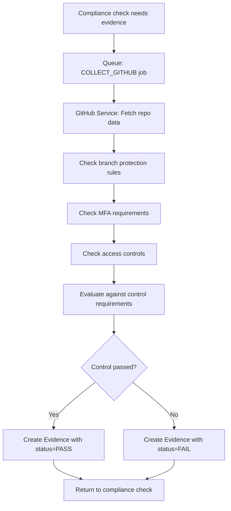

# Dashboard Complete Functionality Guide

## Overview
The Kushim dashboard is the main hub for compliance monitoring. It provides real-time visibility into compliance status, integration health, control performance, and AI-powered insights.

---

## Components & Data Flow

### 1. **Compliance Score Card**
**Location:** `apps/web/components/dashboard/ComplianceScore.tsx`

**What It Should Show:**
- Large circular gauge showing overall compliance percentage (0-100%)
- Trend indicator (up/down/stable)
- Breakdown: Passing, Warning, Failing controls counts
- Total controls count
- CTA button based on state:
  - No integrations → "Connect Integrations"
  - Has integrations but 0% → "Run Compliance Scan"

**Data Source:**
```typescript
GET /api/compliance/controls
```
Returns array of controls with status field (PASS/FAIL/WARNING/PENDING)

**Calculation Logic:**
```typescript
const passingControls = controls.filter(c => c.status === 'PASS').length;
const failingControls = controls.filter(c => c.status === 'FAIL').length;
const warningControls = controls.filter(c => c.status === 'WARNING' || c.status === 'PENDING').length;
const overall = totalControls > 0 ? passingControls / totalControls : 0;
```

**Current Issue:**
- Controls have status but NO ComplianceCheck records exist
- Status defaults to 'PENDING' when no ComplianceCheck exists
- Score shows 0% because no passing controls

**How It SHOULD Work:**
1. User connects integrations (e.g., GitHub)
2. User clicks "Run Compliance Scan"
3. Backend schedules compliance checks for controls matching active integrations
4. Compliance processor runs checks:
   - Fetches/collects evidence from integrations
   - Evaluates evidence against control requirements
   - Creates ComplianceCheck record with status (PASS/FAIL/WARNING)
5. Frontend fetches updated controls with latest check status
6. Score updates to reflect passing controls

---

### 2. **Compliance Trends Card**
**Location:** `apps/web/components/dashboard/ComplianceTrends.tsx`

**What It Should Show:**
- Area chart showing compliance score over last 7 days
- Gradient fill under line
- X-axis: Day labels (Mon, Tue, etc.)
- Y-axis: Score 0-100%

**Data Source:**
```typescript
GET /api/compliance/trends
```
Returns: `Array<{ name: string, score: number }>`

**Current Status:** ✅ Working
- Backend aggregates ComplianceCheck records by day
- Calculates daily pass rate
- Returns 7-day trend data

---

### 3. **Integration Health Section**
**Location:** `apps/web/components/dashboard/IntegrationHealth.tsx`

**What It Should Show:**
- Grid of integration cards (AWS, GitHub, Okta, Jira, Slack)
- Each card shows:
  - Status badge (Healthy/Degraded/Offline)
  - Health score percentage
  - Last sync timestamp
  - Quick stats (e.g., "14 repositories monitored")

**Data Source:**
```typescript
GET /api/reliability/overall
```
Returns integration health metrics for all integrations

**Current Status:** ✅ Working
- Shows connected integrations
- Displays health scores (e.g., GitHub 14.1%)
- Color-coded status indicators

---

### 4. **Control Status Table**
**Location:** `apps/web/components/dashboard/ControlStatus.tsx`

**What It Should Show:**
- Filterable/searchable table of compliance controls
- Columns:
  - Control ID (e.g., CC1.1)
  - Name
  - Framework (SOC2, ISO27001, etc.)
  - Category
  - Status badge (Pass/Fail/Warning)
  - Last checked timestamp
  - Action button (View Details)
- Filter by: Status, Framework, Category
- Search by: Control ID or name
- "Scan Now" button to trigger checks

**Data Source:**
```typescript
GET /api/compliance/controls?page=1&limit=10
```
Returns paginated controls with latest check status

**Current Issue:**
- Table shows controls
- All controls show "PENDING" status
- No ComplianceCheck records to populate actual status

---

### 5. **Recent Alerts Panel**
**Location:** `apps/web/components/dashboard/RecentAlerts.tsx`

**What It Should Show:**
- List of recent compliance alerts/failures
- Each alert shows:
  - Severity icon (high/medium/low)
  - Alert title
  - Timestamp
  - Control affected
- Link to "View All Alerts"

**Data Source:**
```typescript
GET /api/compliance/alerts
```
Returns recent high-priority alerts

**Current Status:** ✅ Working
- Fetches and displays alerts
- Empty state when no alerts

---

### 6. **AI Insights Banner**
**Location:** `apps/web/components/ai/AIInsightsBanner.tsx`

**What It Should Show:**
- Dismissible alert cards with AI-generated insights:
  - **Unmapped Evidence:** "X evidence items need mapping"
  - **Control Gaps:** "X controls are failing"
  - **Pending Policies:** "X policies pending approval"
  - **Cost Spike:** "AI usage cost: $X this week"
- Each insight has:
  - Severity color (red/yellow/blue)
  - Action button that navigates/opens relevant page

**Data Source:**
```typescript
GET /api/ai/insights
```
Returns array of AIInsight objects

**Current Status:** ✅ Working
- Endpoint exists and returns insights
- Action buttons navigate correctly
- Dismissible UI

---

## Complete Data Flow

### Compliance Check Lifecycle

```mermaid
graph TD
    A[User Clicks "Run Compliance Scan"] --> B[POST /api/compliance/scan]
    B --> C[Queue: SCHEDULE_CHECKS job]
    C --> D[Processor: Get customer's active integrations]
    D --> E[Fetch controls for customer's frameworks]
    E --> F{For each control}
    F --> G{Has matching integration?}
    G -->|No| H[Skip control]
    G -->|Yes| I[Queue: RUN_CHECK job]
    I --> J[Processor: Find or collect evidence]
    J --> K{Evidence exists?}
    K -->|No| L[Trigger evidence collection]
    K -->|Yes| M[Evaluate evidence status]
    M --> N[Create ComplianceCheck record]
    N --> O[Store PASS/FAIL/WARNING status]
    O --> P[Frontend fetches updated controls]
    P --> Q[Dashboard updates score]
```

### Evidence Collection Flow



---

## What's Currently Implemented ✅

1. **Frontend:**
   - All dashboard components exist
   - Proper routing (/dashboard)
   - API integration with backend
   - Error handling for failed requests
   - Loading states
   - Responsive design

2. **Backend:**
   - All endpoints exist:
     - GET /api/compliance/controls
     - GET /api/compliance/trends
     - GET /api/compliance/alerts
     - GET /api/reliability/overall
     - POST /api/compliance/scan
     - GET /api/ai/insights
   - Queue infrastructure (BullMQ + Redis)
   - Compliance check processor
   - Evidence collection processor
   - Integration health monitoring

3. **Database:**
   - All tables exist (controls, complianceChecks, evidence, integrations)
   - Proper relations
   - Indexes for performance

---

## What's Broken/Missing ❌

### Critical Issues

1. **No ComplianceCheck Records Created**
   - **Problem:** Compliance processor runs but doesn't create ComplianceCheck records
   - **Cause:** Evidence collection is triggered but may not complete
   - **Impact:** Dashboard shows 0% compliance even after scan
   - **Fix Needed:** Debug evidence collection processor to ensure it:
     - Actually collects GitHub data
     - Creates Evidence records
     - Returns data in correct format for compliance evaluation

2. **Evidence Collection Not Working**
   - **Problem:** GitHub evidence collection jobs are queued but don't complete
   - **Symptoms:** Logs show "No evidence found" warnings repeatedly
   - **Possible Causes:**
     - GitHub service not properly fetching data
     - Evidence not being saved to database
     - Queue processor crashing silently
   - **Fix Needed:** Add detailed logging to evidence collection processor

3. **Control-Integration Mismatch**
   - **Problem:** Most controls require integrations customer doesn't have
   - **Current:** With only GitHub connected, only 5 controls can run
   - **Fix Applied:** Processor now skips controls without matching integrations
   - **Remaining Issue:** Need to verify GitHub controls actually run

### Database State Issues

1. **No CustomerFramework Records**
   - **Fixed:** Added SOC2 framework assignment on registration
   - **For existing customers:** Need to manually add framework assignment

2. **Controls Without Integration Type**
   - **Current:** 28 controls have NULL integrationType (manual controls)
   - **Issue:** These should have some mechanism to be checked/marked

---

## What Needs to Be Fixed (Priority Order)

### Priority 1: Get Evidence Collection Working

**File:** `apps/backend/src/shared/queue/processors/evidence-collection.processor.ts`

**Tasks:**
1. Add extensive logging to track evidence collection
2. Verify GitHub service methods are called correctly
3. Ensure Evidence records are created in database
4. Confirm evidence data format matches what compliance processor expects

**Expected Evidence Format:**
```typescript
{
  status: 'PASS' | 'FAIL',  // Required by compliance processor
  details: {
    // Integration-specific data
    branchProtection: { enabled: true },
    mfaEnabled: true,
    // etc.
  }
}
```

### Priority 2: Verify Compliance Check Creation

**File:** `apps/backend/src/shared/queue/processors/compliance-check.processor.ts`

**Tasks:**
1. Add logging when ComplianceCheck record is created
2. Verify status is correctly extracted from evidence
3. Ensure nextCheckAt is calculated properly
4. Confirm records are saved to database

**Debug Checklist:**
- [ ] SCHEDULE_CHECKS job receives customerId
- [ ] Active integrations are fetched correctly
- [ ] Controls are filtered by matching integration type
- [ ] RUN_CHECK jobs are queued
- [ ] Evidence is found or collection triggered
- [ ] Evidence status is evaluated
- [ ] ComplianceCheck record is created
- [ ] Record is committed to database

### Priority 3: Handle Manual Controls

**Issue:** 28 controls have no integrationType

**Options:**
1. **Manual Review:** Admin marks as PASS/FAIL/N/A
2. **Default PENDING:** Show in dashboard with "Requires Manual Review" badge
3. **Policy-Based:** Auto-pass if policy exists, fail otherwise

**Recommendation:** Start with option 2, add manual review UI later

### Priority 4: Improve Error Visibility

**Add to Dashboard:**
1. Failed scan notification with error details
2. Link to view queue status/logs
3. Button to retry failed checks
4. Debug panel showing:
   - Last scan timestamp
   - Jobs queued vs completed
   - Recent errors

---

## Testing the Complete Flow

### Manual Test Steps

1. **Setup:**
   ```bash
   # Ensure Redis is running
   docker ps | grep redis
   
   # Ensure Postgres is running
   docker ps | grep postgres
   
   # Start backend
   cd apps/backend && npm run dev
   
   # Start frontend
   cd apps/web && npm run dev
   ```

2. **Connect Integration:**
   - Navigate to /integrations
   - Click "Connect" on GitHub
   - Complete OAuth flow
   - Verify integration shows "Connected" with health score

3. **Trigger Compliance Scan:**
   - Navigate to /dashboard
   - Click "Run Compliance Scan"
   - Wait 5-10 seconds

4. **Check Logs:**
   ```bash
   # Watch backend logs for:
   # - "Scheduling compliance checks for customer X"
   # - "Scheduled N compliance checks (skipped M)"
   # - "Running compliance check for control X"
   # - "Evidence collection triggered"
   # - "Completed compliance check. Status: PASS/FAIL"
   ```

5. **Verify Database:**
   ```sql
   -- Check if ComplianceCheck records were created
   SELECT COUNT(*) FROM compliance_checks;
   
   -- Check latest checks
   SELECT status, COUNT(*) 
   FROM compliance_checks 
   GROUP BY status;
   
   -- Check if Evidence was collected
   SELECT COUNT(*) FROM evidence;
   ```

6. **Refresh Dashboard:**
   - Should see updated compliance score
   - Should see controls with PASS/FAIL status
   - Trends should show today's score

### Expected Results

With GitHub connected:
- **Scheduled:** 33 checks (5 GitHub + 28 manual)
- **Skipped:** 31 checks (require AWS/Okta/Jira/Slack)
- **Evidence Created:** 5 records (one per GitHub control)
- **ComplianceCheck Created:** 5 records minimum
- **Compliance Score:** 5/64 = ~7.8% (if all GitHub controls pass)

---

## Debugging Commands

### Check Queue Status
```bash
# Connect to Redis
docker exec -it kushim-redis redis-cli

# List all queues
KEYS bull:*

# Check queue length
LLEN bull:compliance-check:waiting
LLEN bull:evidence-collection:waiting

# View failed jobs
ZRANGE bull:compliance-check:failed 0 -1
```

### Check Database State
```sql
-- Customer frameworks
SELECT c.email, f.code 
FROM customers c 
JOIN customer_frameworks cf ON c.id = cf.customer_id
JOIN frameworks f ON cf.framework_id = f.id;

-- Active integrations
SELECT c.email, i.type, i.status 
FROM customers c
JOIN integrations i ON c.id = i.customer_id;

-- Compliance checks
SELECT 
  c.control_id,
  ctrl.title,
  c.status,
  c.checked_at,
  c.error_message
FROM compliance_checks c
JOIN controls ctrl ON c.control_id = ctrl.id
ORDER BY c.checked_at DESC
LIMIT 10;

-- Evidence
SELECT 
  e.control_id,
  ctrl.title,
  e.collected_at,
  e.data->>'status' as evidence_status
FROM evidence e
JOIN controls ctrl ON e.control_id = ctrl.id
ORDER BY e.collected_at DESC
LIMIT 10;
```

### Enable Debug Logging
Add to `apps/backend/src/main.ts`:
```typescript
app.useLogger(['log', 'error', 'warn', 'debug', 'verbose']);
```

---

## Quick Fixes to Try

### 1. Force Evidence Collection
```typescript
// In apps/backend/src/integrations/github/github.service.ts
// Add method to manually collect evidence for testing

async testEvidenceCollection(customerId: string, controlId: string) {
  const config = await this.getIntegrationConfig(customerId);
  // Collect actual data
  const evidence = await this.collectBranchProtectionEvidence(config);
  // Save to database
  await this.prisma.evidence.create({
    data: {
      customerId,
      controlId,
      integrationId: config.id,
      data: evidence,
      hash: this.hashEvidence(evidence),
      collectedAt: new Date(),
    },
  });
  return evidence;
}
```

### 2. Create Test ComplianceCheck
```sql
-- Manually create a passing check for testing
INSERT INTO compliance_checks (
  id,
  customer_id,
  control_id,
  evidence_id,
  status,
  checked_at,
  next_check_at
)
SELECT 
  gen_random_uuid(),
  c.id,
  ctrl.id,
  NULL,
  'PASS',
  NOW(),
  NOW() + INTERVAL '1 day'
FROM customers c
CROSS JOIN controls ctrl
WHERE ctrl."controlId" = 'CC6.1.1'
LIMIT 1;
```

### 3. Verify Queue Processing
```typescript
// Add to compliance-check.processor.ts
@OnQueueCompleted()
onCompleted(job: Job) {
  console.log('✅ Job completed:', job.id, job.data);
}

@OnQueueFailed()
onFailed(job: Job, error: Error) {
  console.error('❌ Job failed:', job.id, error.message);
}
```

---

## Summary for Next Session

**The core issue is:** Evidence collection is not completing successfully, so no ComplianceCheck records are created, so the dashboard shows 0% compliance.

**Start here:**
1. Add extensive logging to evidence-collection.processor.ts
2. Verify GitHub service methods actually fetch data
3. Confirm Evidence records are saved to database
4. Check that Evidence.data has correct format with `status` field
5. Verify compliance-check.processor receives evidence and creates ComplianceCheck

**Success Criteria:**
- After "Run Compliance Scan", see 5 ComplianceCheck records in database
- Dashboard shows ~7-8% compliance score
- Control Status table shows some controls with PASS/FAIL status
- Trends chart shows data point for today

**Files to Focus On:**
- `apps/backend/src/shared/queue/processors/evidence-collection.processor.ts`
- `apps/backend/src/shared/queue/processors/compliance-check.processor.ts`
- `apps/backend/src/integrations/github/github.service.ts`

Good luck! 🚀
